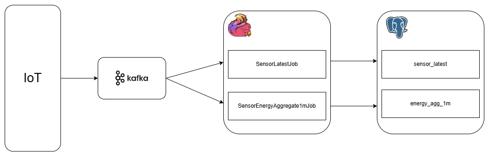

## 1. 개요
IoT 센서 데이터를 실시간으로 수집하고 처리하여, 사용자가 실시간으로 에너지 사용 현황을 조회할 수 있는 EMS(Energy Management System) 데이터 파이프라인 MVP입니다.

## 2. 문제 정의
- 에너지 관리 시스템에서는 센서 데이터가 지속적으로 유입되며, 사용자는 설비별 상태와 에너지 사용량을 가능한 한 빠르게 확인할 수 있어야 합니다.
- 단순 DB 적재 방식은 실시간 데이터 유입량이 늘어날수록 병목이 발생할 수 있고, 수집과 처리를 분리하지 않으면 확장성과 운영 유연성이 떨어질 수 있습니다.
- 이러한 문제를 가정하고, 실시간 이벤트 수집과 처리 구조를 분리한 데이터 파이프라인 MVP를 설계하는 것을 목표로 합니다.

## 3. 목표
사용자가 에너지 설비 최신상태, 1분 집계결과를 **실시간으로 모니터링** 할 수 있는 시스템을 제공.

1. IoT 센서 이벤트를 생성한다.
2. Kafka로 이벤트를 수집한다.
3. Flink로 이벤트를 처리한다.
4. PostgreSQL에 최신 상태와 1분 집계 결과를 저장한다.
5. SQL로 처리 결과를 검증한다.


## 4. 아키텍처



## 5. 기술스택

| 요소        | 기술            | 역할                                          |
|-----------|---------------|---------------------------------------------|
| 메시지 브로커   | Kafka         | IoT 센서 이벤트 수집 및 consumer 분리                 |
| 스트림 처리    | Flink         | 실시간 이벤트 처리, 최신 상태 저장, 1분 window aggregation |
| Storage   | PostgreSQL    | latest 상태 및 집계 결과 저장                        |
| Infra     | Docker | 로컬 개발 및 검증 환경 구성                            |
| Flink Job | Java, Gradle  | Flink streaming job 구현 및 fat jar 빌드         |

## 6. 기술스택 선정 배경

## 7. 현재 구현범위
- Kafka 기반 실시간 이벤트 수집
- Flink 기반 device 별 최신 상태 저장 **(SensorLatestJob)**
- Flink event-time기반 1분 window aggregation **(SensorEnergyAgg1mJob)**
- PostgreSQL에 latest / aggregation 결과 저장

### 7.1) Flink Job

구현된 Flink Job 설명은 아래에서 확인할 수 있습니다.

[Flink Job 목록](./flink-job/README.md)

## 8. Data Flow

### Device 최신상태 Pipeline

1. Python simulator가 IoT 센서 이벤트를 생성합니다.
2. 이벤트는 Kafka topic `raw.sensor.energy`에 적재됩니다.
3. `SensorLatestJob`이 Kafka 이벤트를 consume합니다.
4. JSON 이벤트를 `SensorEvent`로 파싱합니다.
5. `device_id` 기준으로 PostgreSQL `sensor_latest` 테이블에 upsert합니다.

### 센서 에너지 1분 집계 Pipeline

1. `EnergyAgg1mJob`이 동일한 Kafka topic을 별도 consumer group(ems-sensor-agg-1m-job)으로 consume합니다.
2. 이벤트의 `event_time`을 기준으로 watermark를 부여합니다.
3. `site_id + zone_id` 기준으로 keyBy를 수행합니다.
4. 1분 tumbling event-time window를 적용합니다.
5. 평균 전력 사용량, 총 전력 사용량, 이벤트 수를 계산합니다.
6. 결과를 PostgreSQL `energy_agg_1m` 테이블에 upsert합니다.


## 9. Sensor Event 스키마
```json
{
  "device_id": "D-1001",
  "site_id": "SITE-A",
  "zone_id": "ZONE-01",
  "power_usage": 123.45,
  "status": "NORMAL",
  "event_time": "2026-03-25T10:00:01Z",
  "ingestion_time": "2026-03-25T10:00:03Z"
}
```